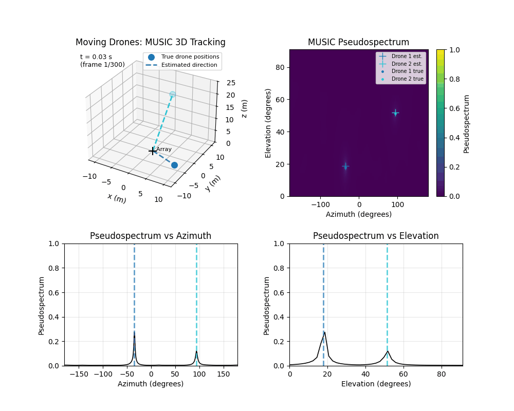
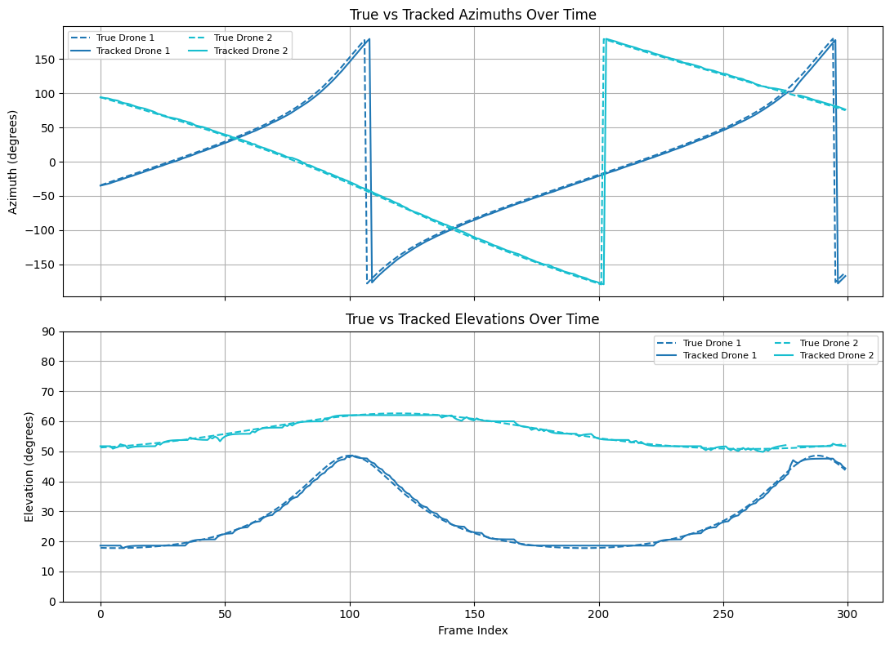
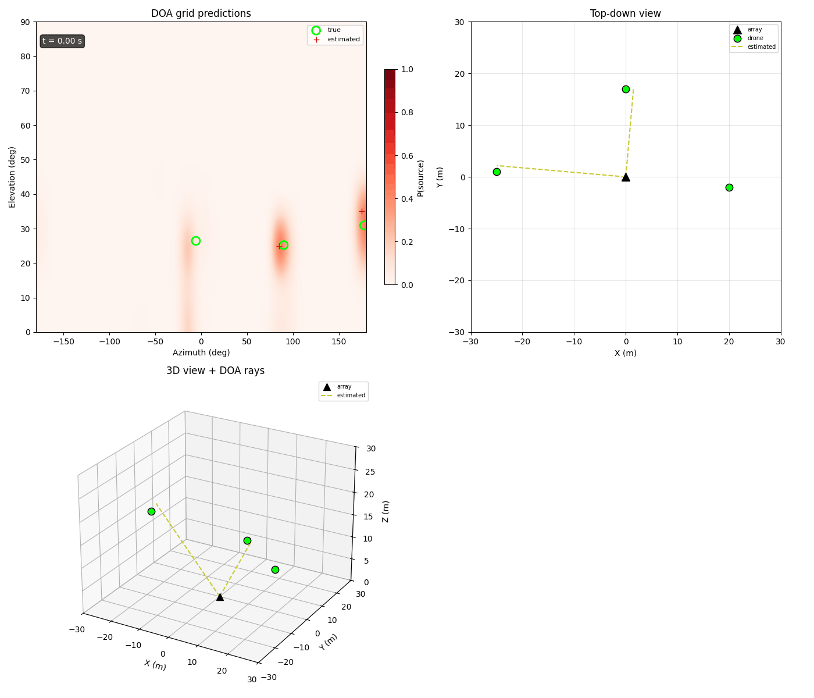
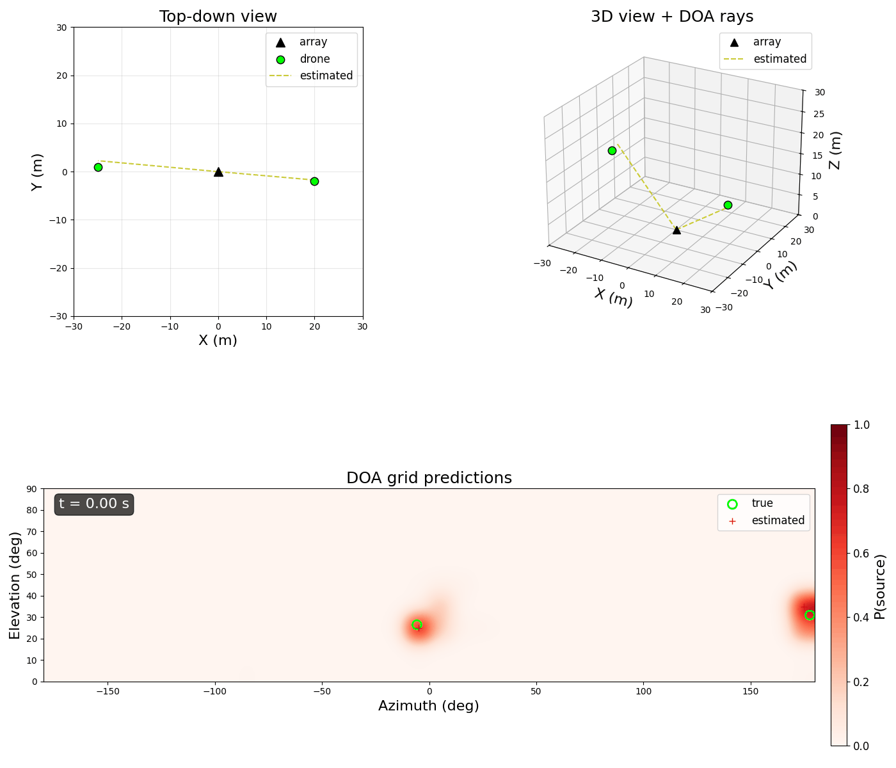

# Multi-Drone Acoustic Tracking

Real-time 3D direction-of-arrival (DOA) estimation and tracking of multiple drones using a compact microphone array. This project demonstrates two complementary approaches — a classical signal processing pipeline and a learned model — both capable of estimating azimuth and elevation for multiple simultaneous targets.

All results use real drone audio from the [Drone Audio Dataset](https://zenodo.org/records/13255372) propagated through a simulated microphone array with realistic impairments (noise, quantization, per-mic gain imbalance).

Details of mic array geometry and code available upon request.

## Performance

| Metric | 2 drones (MUSIC) | 2 drones (model) | 3 drones (model) |
|--------|-----------|----------|----------|
| Azimuth MAE | 2.6° | 2.9° | 4.4° |
| Elevation MAE | 0.5° | 2.7° | 2.6° |

| Metric | Value |
|--------|-------|
| Simultaneous targets | 2–4 drones |
| Audio sampling rate | 16 kHz |
| Tracking update rate | 62.5 Hz |
| Frame duration | 16 ms |
| Inference time | 0.14 ms per frame on RTX 3080 GPU |
| Noise robustness | Robust to low SNR with quantization and per-mic gain mismatch |

---

## Approach 1 — MUSIC Algorithm + Multi-Target Tracker

Classical 3D MUSIC direction-of-arrival estimation paired with a multi-target tracker. Operates over band-limited frequencies to reject false positives from wind noise and other interference. Algorithm does not require prior knowledge of number of targets. Implemented in Python using scientific computing libraries.

### Tracking 2 Drones

*Animation plays in real-time.*

**Source audio:** [Drone 1 — Bebop](audio_music_drone1.wav) | [Drone 2 — Membo](audio_music_drone2.wav)

---

## Approach 2 — Learned DOA Model + Multi-Target Tracker

A data-driven model trained on simulated multi-source scenarios with real drone audio. Outputs a probability map over an azimuth-elevation grid, enabling detection and localization of multiple drones per frame without prior knowledge of the number of targets. Implemented in PyTorch.

Peak detection and velocity-based tracking with coasting produce smooth trajectories even through brief dropouts.

### Tracking 3 Drones

*Animation plays in real-time.*

Mean absolute error: 4.4° azimuth, 2.6° elevation.

**Source audio:** [Drone A](audio_dl_droneA.wav) | [Drone B](audio_dl_droneB.wav) | [Drone C](audio_dl_droneC.wav)

### Tracking 2 Drones

*Animation plays in real-time.*

Mean absolute error: 2.9° azimuth, 2.7° elevation.

**Source audio:** [Drone A](audio_dl_droneA.wav) | [Drone B](audio_dl_droneB.wav)

---

## Extensions

- Joint DOA and target classification (drone vs. wind vs. other)
- Fusion of classical and learned approaches for improved robustness
- Environmental noise modeling and rejection
- Deployment on embedded hardware for field use
- Array geometry optimization for specific deployment scenarios

---

## Contact

Interested in acoustic DOA, drone detection, or array signal processing? I'm available for consulting engagements — reach out via [LinkedIn](https://www.linkedin.com/in/javier-elenes-77342688) or [email](mailto:jelenesm@email.com).
